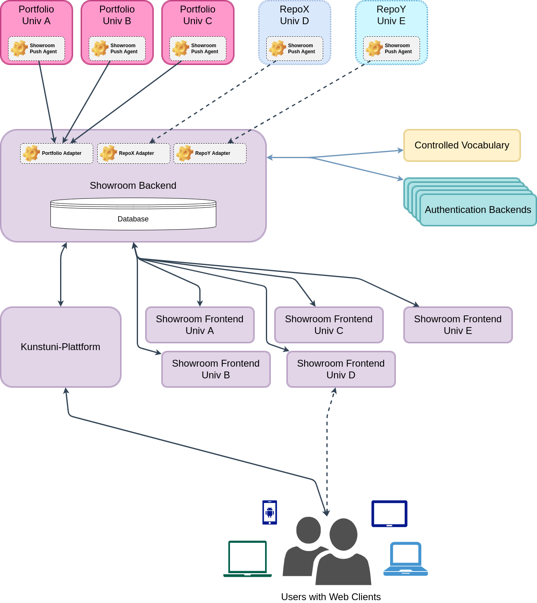

# Architecture and data model

*Showroom* is part of a potential ensemble of applications, that are used to display
current art and research information from several institutions' repositories.

In its most simple setup, *Showroom* will be combined with a single *Portfolio*
instance, and a *CAS/UserPreferences* instance to provide entity data. But it could
also be used to only display the activities that are published from *Portfolio*,
without including any detailed data about the users/publishers of those activites.
In that case a single *Showroom* can be combined with a single *Portfolio* instance,
and the user repository can be disabled in the configuration.

However, *Showroom* is built in a way to accommodate different *Portfolio*
instances as repositories, and in hindsight of adding adapters for other
CRIS or object repositories in the future. This is one of the main reasons why
*Showroom* does not just mirror tha data model used in *Portfolio*.

The following subsections aim to shed some light on the architectural decisions
in this project and how data is handled and transformed.

## The basic architecture

> TODO!

## Ecosystem architecture

> TODO!

## Showroom objects, and the data model

> TODO!

