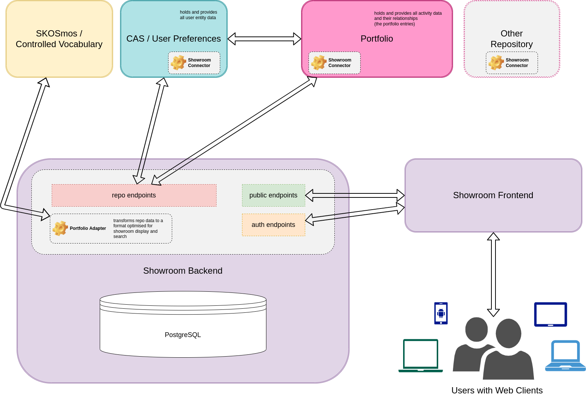
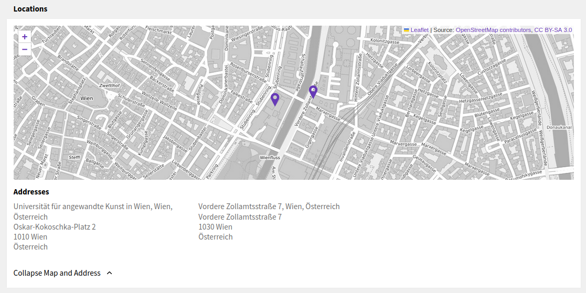
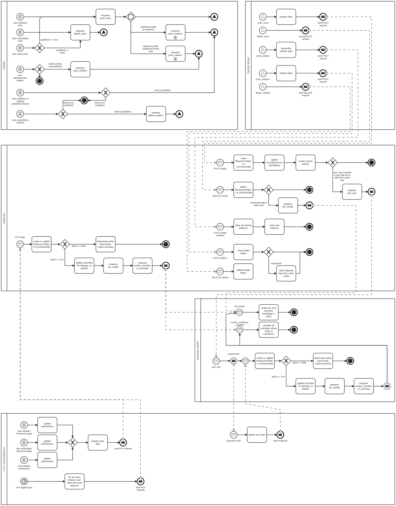

# Architecture and data model

*Showroom* is part of a potential ensemble of applications, that are used to display
current art and research information from several institutions' repositories.

In its most simple setup, *Showroom* will be combined with a single *Portfolio*
instance, and a *CAS/UserPreferences* instance to provide entity data. But it could
also be used to only display the activities that are published from *Portfolio*,
without including any detailed data about the users/publishers of those activites.
In that case a single *Showroom* can be combined with a single *Portfolio* instance,
and the user repository can be disabled in the configuration.

However, *Showroom* is built in a way to accommodate different *Portfolio*
instances as repositories, and in hindsight of adding adapters for other
CRIS or object repositories in the future. This is one of the main reasons why
*Showroom* does not just mirror tha data model used in *Portfolio*.

The following subsections aim to shed some light on the architectural decisions
in this project and how data is handled and transformed.

## The basic architecture

In the following diagram you see a macro perspective on _Showroom_ and how
it is connected to other components. A detailed explanation follows below.

(full-size image: 
drawio source: )

The _Showroom Backend_ setup consists of the following components all running in their
own docker containers:

* _Django_ application (might also be run on the developers host, ideally using a python
  virtual environment. More on that in the  section.)
* _PostgreSQL_ database - storing the data
* _Redis_ store - caching and message queuing

The backend provides a REST API, which is described in more detail in .
It provides public and authenticated endpoints for the frontend, as well as
endpoints with an API key based authentication for repositories to push data to
_Showroom_.

A central component of _Showroom_ is the _Portfolio adapter_, which is responsible for:

* handling all data transformations for entry data that is published in _Portfolio_
* generating all relevant search indices, that are used in the search. 

For more information on the data model see the corresponding section below. For more
details on the search functionality go to .

Apart from the _Showroom Backend_ there is of course also a _Showroom Frontend_, which:

* is a server-side rendered application written with Nuxt.js and Vue.js
* displays all public information to Showroom visitors
* allows logged in users to edit their own descriptin, showcases and activity list
  ordering
* allows logged in users to edit other entities, if configured

Additionally, the backend still provides the classic Django admin for administration
and mostly development and debugging convenience.

To get actual data into _Showroom_ we need a repository, that uses the
`repo` endpoints, to push published entries. In this basic setup we have:

* a single [base Portfolio](https://github.com/base-angewandte/portfolio-backend)
  instance, that pushes entries to Showroom, whenever they are published by its users
* an authentication backend, that also provides information about the users/publishers -
  as long as they have activated their _Showroom_ page
  * This can also be called the _user repository_, which in our basic setup is a single
    instance of [base CAS](https://github.com/base-angewandte/cas) with the
    _User Preferences_ module, that has been added in 1.1. 

While in the described case there is only a single data and a single user repository,
there could be more repositories connected to Showroom. This is elaborated in the next
section.

Finally, there is a controlled vocabulary in form of a [Skosmos](http://www.skosmos.org/)
instance. This is used by Showroom (as well as by Portfolio) to provide localized labels
for a range of concepts described in the data.

## Ecosystem architecture

The following diagram shows the potential application of Showroom in a multi-instance
and multi-stakeholder data ecosystem.

(full-size image: 
drawio source: )

In contrast to what we have seen in the former section on the basic architecture,
here we see how different repositories are connected to a _Showroom Backend_ instance,
who can all push data, that was published by their users. While currently this is
already possible with different _Portfolio_ instances, the adoption of different
CRIS or other data repositories would require the development of a corresponding
adapter.

> Note: while Showroom Backend is developed with hindsight to other potential repo
> adapters, currently we still would need to refactor some significant parts of the
> backend code, to have a fully modularized version, where repo adapters can be
> interchanged by a mere configuration directive and the use of a corresponding module.

Similar to several data repositories, Showroom could also accommodate for different
user repositories / authentication backends. Similar to the idea of repo adapters, this
is still an abstract concept and would require implementation in a later version.

The user in the end should be able to access a _Showroom_ instance through different
frontends. This allows for different institutions to use the same _Showroom_
infrastructure, while still providing a customized or branded user experience to its
own user base. Additionally, their can be joint platforms showcasing the activities
of several institutions in one place.

## Showroom objects, and the data model

Showroom combines data from published entries in data repositories as well as data from
user repositories, if users have activated their Showroom page. These should be
presented in similar user interface structures and also searchable in mostly similar
ways. In addition to what comes in from the repositories, it is also planned to add
albums as another type of Showroom object, which is solely maintained by the users
within Showroom. Similarly, users can already maintain their biographic data and a
showcase for their user page within Showroom.

These are the guiding considerations for the design of the Showroom data model, which
will be explained in a bit more detail in this section.

Showroom contains the following entities, implemented as Django models: 

* `SourceRepository` : a representation of an institution's repository, including the
  API key used by the repository to authenticate.
* `ShowroomObject` : any object in Showroom that can be displayed on a distinct page. So
  far this contains _entities_ (persons, departements and insitutions) and _activities_
  (the entries published in the repository). In the future _albums_ will be a different
  kind of ShowroomObject.
* `EntityDetail` : contains aggregated data only for ShowroomObjects of an _entity_ type
* `ActivityDetail` : contains aggergated data only for ShowroomObjects that are
  _activities_
* `Media` : stores metadata about media that are associated with a ShowroomObject
  (usually an activity). The media files themselves are not stored in Showroom, only
  the links to the publicly consumable media in the SourceRepository.

Further, the following (explicit) Django models are used to manage relationships
between ShowroomObjects or to create search indices:

* Relation
* ContributorActivityRelations
* TextSearchIndex
* DateSearchIndex
* DateRangeSearchIndex
* DateRelevanceIndex

The following diagram displays those core models (with a green box color), as well
as the available endpoints in the API (with a light magenta-ish box color) and all
the elaborated data formats (with a light violet box color), that are used by the
API, or by some object properties to store information. Additionally the elaborated
data formats in the diagram display the relations between actual core model data
and what the clients get through the API.

(full-size image: 
drawio source: )

What this model does not show are the transformations from an activity's source data
format in the repository (e.g. as it is stored in _Portfolio_) to how it is stored
in Showroom. This will be elaborated in the next section.

### Data transformations

When a repository pushes one of its entries to Showroom, it has to be transformed into
a _ShowroomObject_ of the type `activity`. In Showroom all published entries from
repositories are framed as activities which belong to a user, which is linked in
the activities, if they also have activated their Showroom user page. Those activities
then fall into different categories, like "document/publication", "exhibition", "audio",
"research project", or one of the many more available categories.

Depending on which category this activity falls into, it should be displayed differently
in Showroom.

While the Showroom Frontend is finally responsible for displaying the results, the
Showroom Backend is responsible for already preparing the data to be displayed, so that
that most of the needed transformations are done already on creation/update of an
activity, and the data is ready for the response, whenever a client requests the
activity.

So, while the original data from the repository will be stored on the _ShowroomObject_
in the `source_repo_data` property, the following properties should already hold the
data as it is displayed by the Showroom Frontend:

* `title`
* `subtext`
* `primary_details`
* `secondary_details`
* `list`
* `locations`

The following subsections list which of the properties from the repository data should
be transformed into which of those ShowroomObject properties, based on which category /
activity type they fall in.

Below these sections we provide a bit more detail on how those transformations are
supposed to work.

The following subsection explains how and why data coming from a repository has to be
transformed in general. Depending on the specific category of entry, different fields
have to be transformed and mapped. The specific mapping of data to those mentioned
fields can be found in the Appendix section .

#### Details on how to transform data

To shed some light on how the data will be displayed, the following screenshot of an
activity in Showroom contains additional area markings in red, with the _ShowroomObject_
properties, which are used by the Frontend to display the data:

(full-size image: )

Here you also see, that the `type` is displayed in one area. But it is not mentioned
in the above transformation definitions. This is because the `type` contains the data
as it comes from Portfolio, and the Showroom Frontend uses a specific component to
display it.

What is missing from the above screenshot is how the `location` property will be
displayed. The next screenshot is from a different activity, containing two locations:

(full-size image: )

The `location` property is an array containing objects (for each location found in the
repository data). Each of the location objects contains a `data` property and a
`coordinates` property, both are arrays. The latter just holds two floating-point
numbers: the latitude and the longitude. These are used to display the markers on the
map. The `data` array contains a list of strings, which are used to display the
lines of each address below the map.

Now for the `primary_details`, `secondary_details` and `list`, we need the data in a way
that can be displayed easily by the frontend without the need for any additional
transformations or data mappings. To display this data the Showroom Frontend uses the
[base-ui-components](https://github.com/base-angewandte/base-ui-components). There is a
[Base UI Components styleguide](https://base-angewandte.github.io/base-ui-components/)
showcasing every component: how it looks like and how the data has to look like.
Both, the `primary_details` and the `secondary_details` are displayed with the
[BaseTextList](https://base-angewandte.github.io/base-ui-components/#basetextlist),
while the `list` is displayed with the
[BaseExpandList](https://base-angewandte.github.io/base-ui-components/#baseexpandlist).
These are the templates for how we need to provide data to the frontend, and in
consequence for how we already want to store it in the backend database.

The aim of _Showroom Backend_ is to transform the repository data in a way, so we can
store it almost exactly as the frontend needs the data in the _ShowroomObject_. But
there is one catch: we need to localize the data for all available languages too. Yet
the frontend will request the data only for a specific language. Therefore we transform
all mapped items for every language and store them under specific language keys in
each item of the property. When the frontend requests a an activity the backend only
has to filter our the requested language before it returns the data.

The main implementation of this mapping and transformation for data coming from
Portfolio happens in the following two files:

* _src/api/repositories/portfolio/transform.py_
* _src/api/repositories/portfolio/mapping.py_

When writing an adapter for a different repository, take those two examples as a
template.

### Data flow

The following BPMN diagram shows the process (and data) flows, happening between
the different components of the Portfolio/Showroom ecosystem. The aim here is not to
describe any flows within a component, but give an overview of which actions in which
components trigger which API calls and worker jobs, based on data that has to be
(re-)rendered or in other ways processed.

Note that user interaction with Showroom Backend itself (through the Showroom Frontend),
is not listed here. This is because all direct user interactions with Showroom should
be able to be handled without interaction with other systems.

(full-size image: 
bpmn source: )
